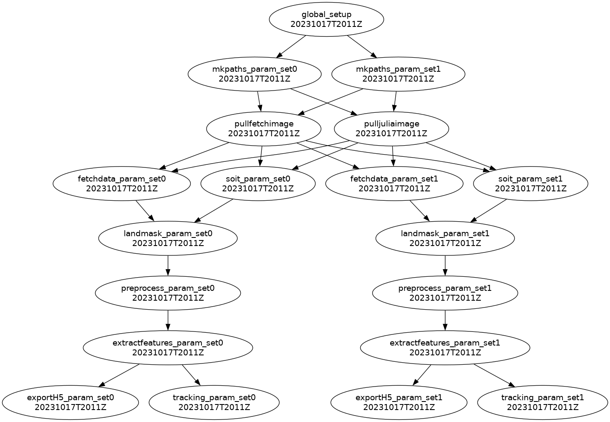

[](https://github.com/WilhelmusLab/ice-floe-tracker-pipeline/actions/workflows/test.yml?query=branch%3Amain) [](https://codecov.io/gh/WilhelmusLab/ice-floe-tracker-pipeline)
# Ice Floe Tracker Pipeline

This repository contains the processing pipeline for IceFloeTracker.jl and ancillary scripts.

## SOIT Integration

The [Satellite Overpass Identification Tool](https://zenodo.org/record/6475619#.ZBhat-zMJUe) is called to generate a list of satellite times for both Aqua and Terra in the area of interest. This program is written in Python and its dependencies are pulled from a Docker container at `docker://brownccv/icefloetracker-fetchdata:main`. 

Register an account with [space-track.org](https://www.space-track.org/) to use SOIT. 

To run SOIT manually :
1. Make sure Docker Desktop is running on your local machine.
2. Export SOIT username/password to environment variable.
   - [ ] From your home directory `nano .bash_profile`
   - [ ] add `export HISTCONTROL=ignoreboth` to the bottom of your .bash_profile
        * this will ensure that your username/password are not stored in history
        * when exporting the following environment variables, there __must__ be a space in front of each command
   - [ ] ` export SPACEUSER=<firstname>_<lastname>@brown.edu`
   - [ ] ` export SPACEPSWD=<password>`
3. Update inputs and run the following: 
```bash
docker run --env SPACEUSER --env SPACEPSWD --mount type=bind,source=<your_desired_output_dir>,target=/tmp brownccv/icefloetracker-fetchdata:main \
python3 /usr/local/bin/pass_time_cylc.py --startdate <YYYY-MM-DD> --enddate <YYYY-MM-DD> --csvoutpath /tmp --centroid_x <input_centroid_x> --centroid_y $<input_centroid_y> --SPACEUSER $SPACEUSER --SPACEPSWD $SPACEPSWD
```
   * be sure to replace `source`, `startdate`, `enddate`, `centroid_x`, and `centroid_y` with your desired inputs
   * csvoutpath must remain as `/tmp` to bind the Docker container output path with your desired local path

**Note:** The `pass_time_cylc.py` script in this project can be adapted to include additional satellites available in the [space-track.org](https://www.space-track.org/) repository. If you have `numpy` and `skyfield` installed in a local `conda` environment, you can run `pass_time_cylc.py` from the directory where you installed the Ice Floe Tracker Pipeline:
```python3 workflow/scripts/pass_time_cylc.py --startdate <YYYY-MM-DD> --enddate <YYYY-MM-DD> --csvoutpath /tmp --centroid_x <input_centroid_x> --centroid_y $<input_centroid_y> --SPACEUSER $SPACEUSER --SPACEPSWD $SPACEPSWD```

## Fetching data from NASA Worldview

All the software dependencies to run `fetchdata.sh` are found in the Docker container at `docker://brownccv/icefloetracker-fetchdata:main`.

To fetch data independently of other tasks:
1. Make sure Docker Desktop is running on your local machine.
2. Update inputs and run the following: 
```bash
docker run --mount type=bind,source=<your_desired_output_dir>,target=/tmp \
brownccv/icefloetracker-fetchdata:main \
/usr/local/bin/fetchdata.sh -o /tmp -s <YYYY-MM-DD> -e <YYYY-MM-DD> -c <wgs84|epsg3413> -b <top_left_lat@top_left_lon@lower_right_lat@lower_right_lon|left_x@top_y@right_x@lower_y
```
   * be sure to replace `source`, `s`(startdate), `e`(enddate), `c`(crs), and `b`(bounding box) with your inputs
   * `o`(output) must remain as `/tmp` to bind the Docker container output path with your desired local path
   * `c`(crs) must be either wgs84 (lat/lon) or epsg3414 (polar stereographic)
   * `b`(bounding box) inputs must match the crs

## Cylc to run the pipeline

Cylc is used to encode the entire pipeline from start to finish and relies on the command line scripts to automate the workflow. The `config/cylc_hpc/flow.cylc` file should be suitable for runs on HPC systems. The default pipeline is built to run on Brown's Oscar HPC and each task is submitted as its own batch job. To run Cylc locally, the `config/cylc_local/flow.cylc` file is used.

### Generating the `flow.cylc` file to iterate through parameter sets

We can use Jinja2 to populate a `flow.cylc` file using a CSV file with input parameters. 
1. Use the `sample_site_locations.csv` to fill in your desired parameters, one row for each set. Save as `site_locations.csv` in the `config` directory.
These fieds are required:  
   - `location` (string name)
   - `center_lat` (int wgs84)
   - `center_lon` (int wgs84)
   - `startdate` (YYYY-MM-DD)
   - `enddate` (YYYY-MM-DD)

   For wgs84 (lat/lon), use: 
   - `top_left_lat`
   - `top_left_lon` 
   - `lower_right_lat`
   - `lower_right_lon`

   For epsg3413 (polar stereographic), use:
   - `left_x`
   - `right_x`
   - `lower_y`
   - `top_y`

**Note:** bounding box format = top_left_x top_left_y bottom_right_x bottom_right_y (x = lat(wgs84) or easting(epsg3413),  y = lon(wgs84) or northing(epsg3413))

2. Jump to either running the Cylc pipeline on [Oscar](#running-the-cylc-pipeline-on-oscar) or [local](#running-the-cylc-pipeline-locally)

### Running the Cylc pipeline on Oscar

1. - [ ] Connect to Oscar from VS Code
    * [use this guide](https://docs.ccv.brown.edu/oscar/connecting-to-oscar/remote-ide)

2. Build a virtual environment and install Cylc
   - [ ] `cd <your-project-path>/ice-floe-tracker-pipeline`
   - [ ] `conda env create -f ./config/ift-env.yaml`
   - [ ] `conda activate ift-env`

3. Make sure you have registered for an account with `space-track.org` and exported your SOIT credentials as an environment variable on Oscar as outlined in the [SOIT integration](#soit-integration) section.

4. Prepare the runtime environment 

    Cylc will use software dependencies inside a Singularity container to fetch images and satellite times from external APIs. 
   - [ ] It is a good idea to reset the Singularity cache dir to `scratch` as specified [here](https://docs.ccv.brown.edu/oscar/singularity-containers/building-images). Images take up a lot of space and `scratch` gets cleaned regularly.

   - [ ] first populate the `flow.cylc` file by running: 
   ```python
   python workflow/scripts/flow_generator.py \
   --csvfile "./config/site_locations.csv" \
   --template "flow_template_hpc.j2" \
   --template_dir "./config/cylc_hpc" \
   --crs "<crs>" \
   --minfloearea <value> \
   --maxfloearea <value>
   ```
Run `python workflow/scripts/flow_generator.py --help` for a list of options.

   - [ ] then, build the workflow, run it, and open the Terminal-based User Interface (TUI) to monitor the progress of each task. 
    

   ```bash
   cylc install -n <workflow-name> ./config/cylc_hpc
   cylc validate <workflow-name>
   cylc play <workflow-name>
   cylc tui <workflow-name>
   ```
   You can also get an image of the task dependency graph with `cylc graph <workflow-name>`; you have to click the generated link to open it in VS Code.
   

   - [ ] If you need to change parameters and re-run a workflow, first do:
    
   ```bash
   cylc stop --now <workflow-name>
   cylc clean <workflow-name>
   ```
   - [ ] Then, proceed to install, play, and open the TUI

**Note:** Error logs are available for each task:

   ```bash
   cat ./cylc-run/<workflow-name>/<run#>/log/job/1/<task-name>/01/job.err
   ```
   The entire `cylc-run` workflow generated by Cylc is also symlinked to `~/ice-floe-tracker-pipeline/workflow/cylc-run/`. 
   Julia logging is also available at `~/ice-floe-tracker-pipeline/workflow/report/` 

   Failed tasks with retry automatically. If all retrys fail, there are likely too many clouds in the study area for the given dates. Try using the NASA Worldview web app to find better dates with fewer clouds. For large bounding boxes, you may need to increase the memory or cpus-per-task flags in the `cylc_hpc/flow.cylc` file for tasks that are failing.
   
### Running the Cylc pipeline locally

#### Prerequisites
__Julia:__ When running locally, make sure you have at least Julia 1.9.0 installed with the correct architecture for your local machine. (https://julialang.org/downloads/)

__Docker Desktop:__ Also make sure Docker Desktop client is running in the background to use the Cylc pipeline locally. (https://www.docker.com/products/docker-desktop/)

1. Build a virtual environment and install Cylc
   - [ ] `cd <your-project-path>/ice-floe-tracker-pipeline`
   - [ ] `conda env create -f ./config/ift-env.yaml`
   - [ ] `conda activate ift-env`

**Note:** Depending on your existing Conda config, you may need to update your `.condarc` file to: `auto_activate_base: false` if you get errors running your first Cylc workflow.

2. Make sure you have registered for an account with `space-track.org` and exported your SOIT credentials as an environment variable on your local computer as outlined in the [SOIT integration](#soit-integration) section.

3. Install your workflow, run it, and monitor with the Terminal User Interface (TUI)

   - [ ] first populate the `flow.cylc` file by running: 
   ```python
   python workflow/scripts/flow_generator.py \
   --csvfile "./config/site_locations.csv" \
   --template "flow_template_local.j2" \
   --template_dir "./config/cylc_local" \
   --crs "<crs>" \
   --minfloearea <value> \
   --maxfloearea <value>
   ```
   Run `python workflow/scripts/flow_generator.py --help` for a list of options.

   - [ ] `cylc install -n <your-workflow-name> ./config/cylc_local`
   - [ ] `cylc graph <workflow-name> #install graphviz locally`
   - [ ] `cylc validate <workflow-name>`
   - [ ] `cylc play <workflow-name>`
   - [ ] `cylc tui <workflow-name>`

The Terminal-based User Interface provides a simple way to watch the status of each task called in the `flow.cylc` workflow. Use arrow keys to investigate each task (see more [here](https://cylc.github.io/cylc-doc/latest/html/7-to-8/major-changes/ui.html#cylc-tui).
).

If you need to change parameters and re-run a workflow, first do:
    
   ```bash
   cylc stop --now <workflow-name>
   cylc clean <workflow-name>
   ```
   - [ ] Then, proceed to install, play, and open the TUI
   - [ ] To rerun in one line: 
   ```bash
   cylc stop --now <workflow-name> && \
   cylc clean <workflow-name> && \
   cylc install -n <workflow-name> ./config/cylc_hpc && \
   cylc validate <workflow-name> && \
   cylc play <workflow-name> && \
   cylc tui <workflow-name>
   ```

**Note:** Error logs are available for each task:
    
   ```bash
   cat ~/cylc-run/<workflow-name>/<run#>/log/job/1/<task-name>/01/job.err
   ```

### Tips for running the code locally for development

When working locally, double check that the Docker client is running and clean the Docker cache to make sure you are using the latest images.
- [ ] delete any existing images from the Docker Dashboard
- [ ] from a terminal, run: 
```bash
docker rm $(docker ps -aq)
```
- [ ] from a terminal, run: 
```bash
docker image prune
```

When running locally, make sure you have at least Julia 1.9.0 installed with the correct architecture for your local machine. (https://julialang.org/downloads/)

- [ ] `cd <your-project-path>/ice-floe-tracker-pipeline`

Open a Julia REPL and build the package
- [ ] `julia`

Enter Pkg mode and precompile
- [ ] `]`
- [ ] `activate .`
- [ ] `build`

Use the backspace to go back to the Julia REPL and start running Julia code!

__Note__ Use the help for wrapper scripts to learn about available options in each wrapper function
For example, from a bash prompt: 
`julia --project=. ./workflow/scripts/ice-floe-tracker.jl extractfeatures --help`

## Sample workflows to read in data stored in hdf5 files with Python

Due to differences in multidimensional array representation between Julia and Python, special handling might be necessary.

### Read floe properties table to a pandas dataframe

```python
import h5py
import pandas as pd
from os.path import join

dataloc = "results/hdf5-files"
filename = "20220914T1244.aqua.labeled_image.250m.h5"

ift_data = h5py.File(join(dataloc, filename))
df = pd.DataFrame(
    data=ift_data["floe_properties"]["properties"][:].T, # note the transposition
    columns=ift_data["floe_properties"]["column_names"][:].astype(str),
)

df.head()

```

### Simple visualization of a segmented image
```python
import numpy as np
import matplotlib.pyplot as plt

ift_segmented = ift_data['floe_properties']['labeled_image'][:,:].T # note the transposition
ift_segmented = np.ma.masked_array(ift_segmented, mask=ift_segmented==0)

fig, ax = plt.subplots()
ax.imshow(ift_segmented, cmap='prism')
```
