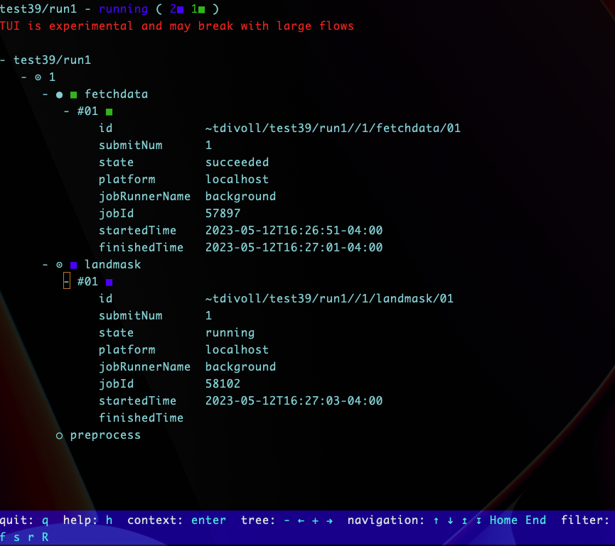

# Ice Floe Tracker Pipeline

This repository contains the processing pipeline for IceFloeTracker.jl and ancillary scripts.

## SOIT Integration

The [Satellite Overpass Identification Tool](https://zenodo.org/record/6475619#.ZBhat-zMJUe) is called to generate a list of satellite times for both Aqua and Terra in the area of interest. This program is written in Python and its dependencies are pulled from a docker container at `docker://brownccv/icefloetracker-fetchdata:latest`.

**Note:** the `pass_time_cylc.py` script in this project can be adapted to include additional satellites available in the [space-track.org](https://www.space-track.org/) repository.

Export SOIT username/password to environment variable:
   - [ ] From your home directory`nano .bash_profile`
   - [ ] add `export HISTCONTROL=ignoreboth` to the bottom of your .bash_profile
        * this will ensure that your username/password are not stored in history
        * when exporting the following environment variables, there must a space in front of each command
   - [ ] ` export SPACEUSER=<firstname>_<lastname>@brown.edu`
   - [ ] ` export SPACEPSWD=<password>`

## Cylc to run the pipeline

Cylc is used to encode the entire pipeline from start to finish and relies on the command line scripts to automate the workflow. The `config/cylc_hpc/flow.cylc` file should be suitable for runs on HPC systems. To run Cylc locally, there are a few commands to run from a terminal in the root directory of this project:


Build a virtual environment and install Cylc
   - [ ] `cd <your-project-path>/ice-floe-tracker-pipeline`
   - [ ] `conda env create -f ./config/ift-env.yaml`
   - [ ] `conda activate ift-env`

```
cylc install -n <your-workflow-name> ./config/cylc_local
cylc graph <workflow-name> #install graphviz locally
cylc play <workflow-name>
cylc tui <workflow-name>
```
The text-based user interface provides a simple way to watch the status of each task called in the `flow.cylc` workflow. Use arrow keys to investigate each task as see more [here](https://cylc.github.io/cylc-doc/latest/html/7-to-8/major-changes/ui.html#cylc-tui).


## Running the workflow on Oscar

1. - [ ]Connect to Oscar from VS Code
    * [use this guide](https://docs.ccv.brown.edu/oscar/connecting-to-oscar/remote-ide)

2. Move to a compute node
   - [ ] `interact -n 20 -t 24:00:00 -m 32g`
    * this will start a compute session for 1 day with 32 GB memory and 20 cores
    * see [here](https://docs.ccv.brown.edu/oscar/submitting-jobs/interact) for more options

3. Load the Julia module
   - [ ] `module load julia/1.9.0`

4. Build a virtual environment and install Cylc
   - [ ] `cd ice-floe-tracker-pipeline`
   - [ ] `conda env create -f ./config/ift-env.yaml`
   - [ ] `conda activate ift-env`

5. Register an account with [space-track.org](https://www.space-track.org/) for SOIT

6. Export SOIT username/password to environment variable
   - [ ] From your home directory`nano .bash_profile`
   - [ ] add `export HISTCONTROL=ignoreboth` to the bottom of your .bash_profile
        * this will ensure that your username/password are not stored in history
        * when exporting the following environment variables, there __must__ be a space in front of each command
   - [ ] ` export SPACEUSER=<firstname>_<lastname>@brown.edu`
   - [ ] ` export SPACEPSWD=<password>`

7. Prepare the runtime environment 

    Cylc will use software dependencies inside a Singularity container to fetch images and satellite times from external APIs. 
   - [ ] It is a good idea to reset the Singularity cache dir as specified [here](https://docs.ccv.brown.edu/oscar/singularity-containers/building-images)

   - [ ] first update the parameters at the top of the `flow.cylc` file:
     - startdate
     - enddate
     - crs
     - bounding_box
     - centroid_x #lat wgs84
     - centroid_y #lon wgs84
     - minfloearea
     - maxfloearea
     **Note:** bounding box format = top_left_x top_left_y bottom_right_x bottom_right_y (x = lat(wgs84) or easting(epsg3413),  y = lon(wgs84) or northing(epsg3413))

   - [ ] run `singularity build fetchdata.simg docker://brownccv/icefloetracker-fetchdata:latest`
        * This will pull the image containing all the depencies and make them accessible to Cylc
   - [ ] then, build the workflow, run it, and open the text-based user interface (TUI) to monitor the progress of each task. 
    

    ```
    cylc install -n <workflow-name> ./config/cylc_hpc
    cylc play <workflow-name>
    cylc tui <workflow-name>
    ```

   - [ ] If you need to change parameters and re-run a workflow, first do:
    
    ```
    cylc stop --now <workflow-name>
    cylc clean <workflow-name>
    ```
   - [ ] Then, proceed to install, play, and open the TUI

    __Note__ Error logs are available for each task:
    ```
    cat ~/cylc-run/<workflow-name>/<run#>/log/job/1/<task-name>/01/job.err
    ```